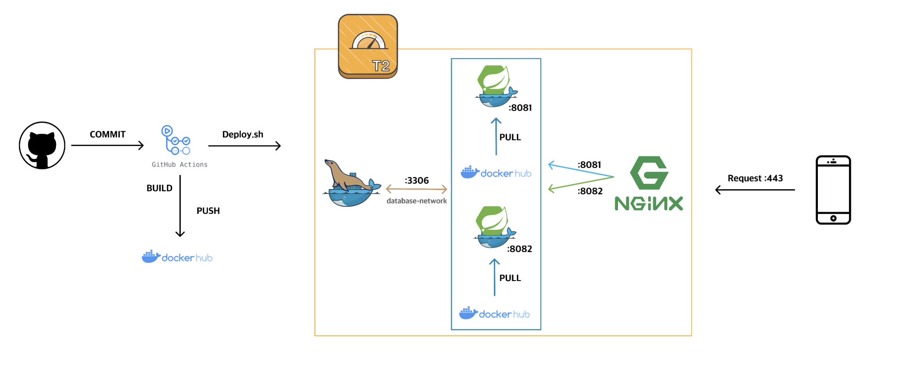

# README


### 도커 설치

- docker 설치
- docker compose 설치

### 네트워크 생성
```
docker network create database-network
```

### 마리아 DB 실행
```
docker-compose -p mariadb -f docker-compose.mariadb.yml up -d
```

`** 마리아 DB 실행후 외부 접속 하기 위해서는 마리아 db 컨테이너에 접속 후 root 나 다른 계정 외부 접속 권한 부여해야합니다. **`


## 🚀배포 플로우


